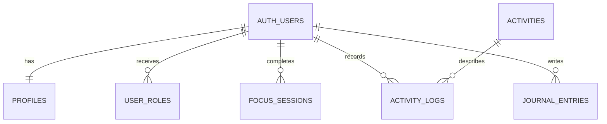

# WellSpring

WellSpring is a responsive multi-page wellbeing app capstone. It combines focus sessions, healthy audio, active movement, herbs and tea rituals, private journaling, profiles, photo upload, authentication, roles, and an admin area.

> Live application: [wellspring-health-app.netlify.app](https://wellspring-health-app.netlify.app)

## Highlights

- Focus timer with presets, intentions, session history, and weekly statistics
- Searchable movement catalogue with filters and a daily activity goal
- Interactive healthy sound library with generated ambient previews
- Searchable herbs and tea guide with favorites and safety information
- Full CRUD mood journal with persistent private reflections
- Email/password authentication with email confirmation
- Personal profile, progress dashboard, and private profile-photo upload/download
- Protected member data using PostgreSQL Row Level Security
- Role-based administrator area with CRUD management for movement activities and the herbs guide
- Responsive desktop and mobile navigation
- Automated Playwright tests and GitHub Actions quality checks

## Technology

| Layer | Technology |
|---|---|
| Frontend | HTML5, CSS3, JavaScript ES modules |
| UI | Bootstrap 5, Bootstrap Icons |
| Tooling | Vite, npm |
| Backend | Supabase PostgreSQL and Data API |
| Identity | Supabase Auth with JWT sessions |
| Files | Supabase Storage |
| Security | Row Level Security and role policies |
| QA | Playwright, GitHub Actions |
| Hosting | Netlify |

## Application pages

| Page | Purpose |
|---|---|
| Home | Wellness overview and primary paths |
| Focus | Pomodoro-style timer and focus history |
| Music | Filterable ambient sound experience |
| Move | Searchable activity catalogue and daily goal |
| Herbs | Tea preparation and safety guide |
| Journal | Private create, read, update, and delete workflow |
| Authentication | Registration, confirmation, and sign-in |
| Profile | Personal details, photo, and real progress statistics |
| Admin | Protected role-based management area |

## Architecture

```text
HTML pages → page modules → service modules → Supabase Auth/Data/Storage
                       ↘ localStorage demo adapter
```



The committed migration creates eight application tables, normalized relationships, history indexes, a new-user trigger, RLS policies, starter content, and two Storage buckets. See [Supabase setup](docs/SUPABASE_SETUP.md).

## Run locally

Requirements: Node.js 20 or newer and npm.

```bash
git clone https://github.com/simonsvp/wellspring-health-app.git
cd wellspring-health-app
npm install
npm run dev
```

Without environment variables, WellSpring starts safely in local demo mode. To use Supabase, copy `.env.example` to `.env` and add the Project URL and publishable key:

```env
VITE_SUPABASE_URL=https://your-project.supabase.co
VITE_SUPABASE_PUBLISHABLE_KEY=your-publishable-key
```

Never place a secret or `service_role` key in frontend code.

The production build includes only the browser-safe Supabase project URL and publishable key. Secret and `service_role` keys are never committed or exposed to the client.

## Quality assurance

```bash
npm run build
npm run test:desktop
npm test
```

The test build explicitly uses demo mode through `.env.test`, keeping automated runs isolated from production accounts and data. Test assets include a QA plan, bug-report template, and Playwright coverage for navigation and core wellness workflows.

## Sample account

The deployed application provides this evaluator account:

```text
Email: demo@wellspring.app
Password: Demo123!
Role: Member
```

## Safety and privacy

WellSpring provides general educational wellness information, not diagnosis or treatment. Herb guidance includes safety notices and official reference links. Personal journals, activity logs, focus sessions, profiles, and private avatar objects are protected by owner-scoped RLS policies.

## AI assistance

AI tools supported planning, implementation, refactoring, visual design, test generation, and documentation. Every change was reviewed through manual exploratory testing, automated browser checks, and incremental Git commits.
