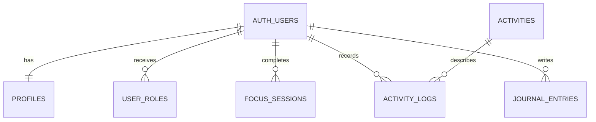

# WellSpring

WellSpring is a responsive multi-page wellbeing app for the SoftUni AI “Software Technologies with AI” capstone. It combines focus sessions, healthy audio, active movement, herbs/tea rituals, private journaling, profiles, photo upload, authentication, roles, and an admin area.

## Architecture and screens

Separate Vite HTML entry points cover Home, Focus, Music, Activities, Herbs, Journal, Auth, Profile, and Admin. Shared Bootstrap presentation lives in `src/css`; layout, pages, and services are split into ES modules under `src/js`. Supabase provides PostgreSQL data, JWT authentication, RLS, and Storage. Without environment variables the app starts in local demo mode.

```text
HTML pages → page modules → service modules → Supabase REST/Auth/Storage
                       ↘ localStorage demo adapter
```



The migration creates eight application tables, indexes, a new-user trigger, admin checks, RLS policies, and two Storage buckets.

## Local setup

1. Install Node.js 20 or newer and run `npm install`.
2. Copy `.env.example` to `.env` and add the Supabase URL and anon key, or skip for demo mode.
3. Run the SQL migration using Supabase CLI/dashboard.
4. Start with `npm run dev`; build with `npm run build`.

In demo mode, any email and password of six or more characters works. Use `admin@example.com` / `demo123` for admin access. For deployment, configure the two Vite environment variables in Netlify or Vercel and publish `dist`.

WellSpring offers general educational wellness content, not diagnosis or treatment.
